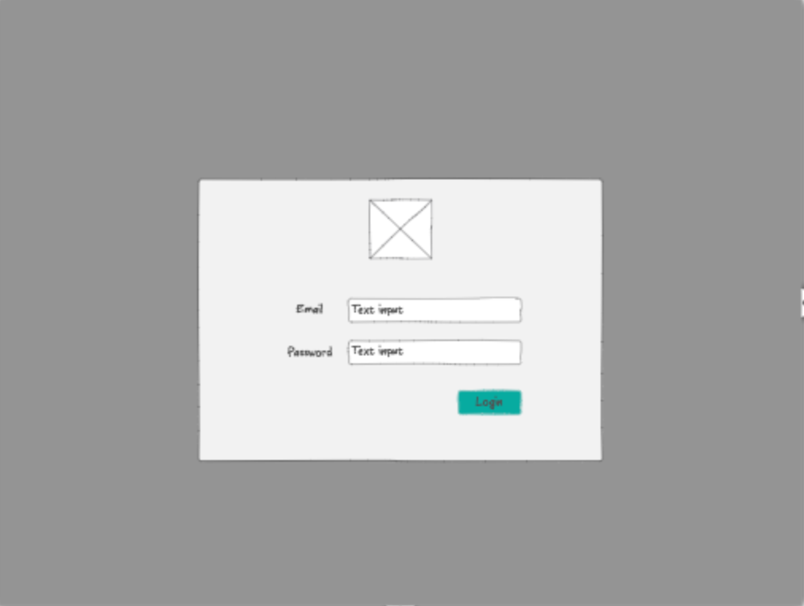
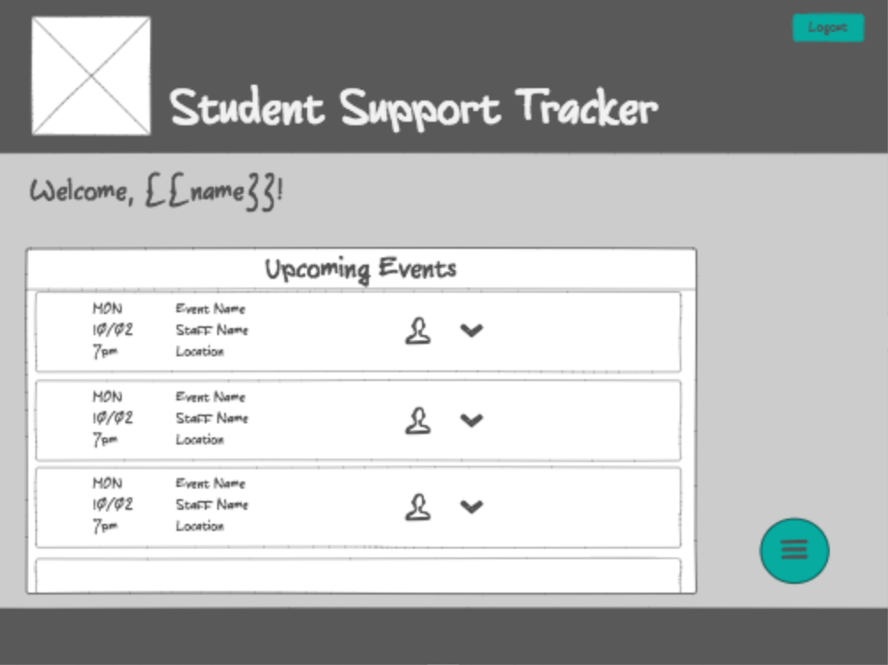
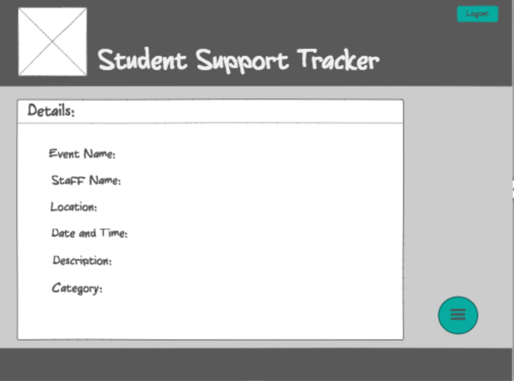
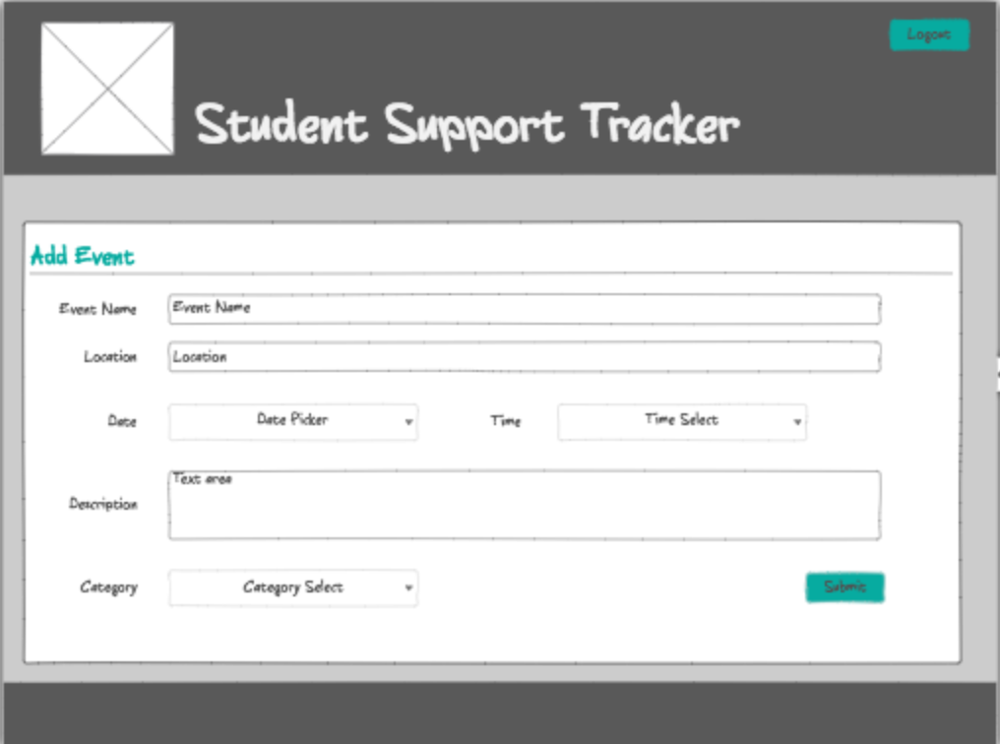
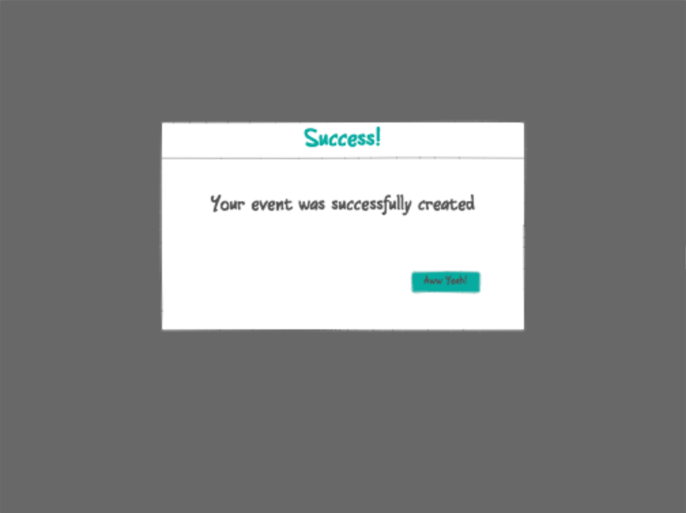
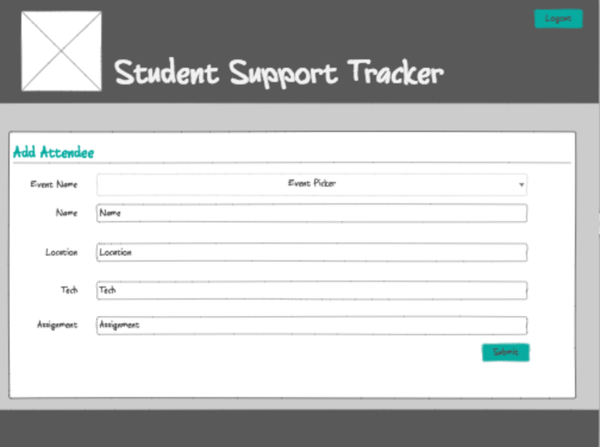
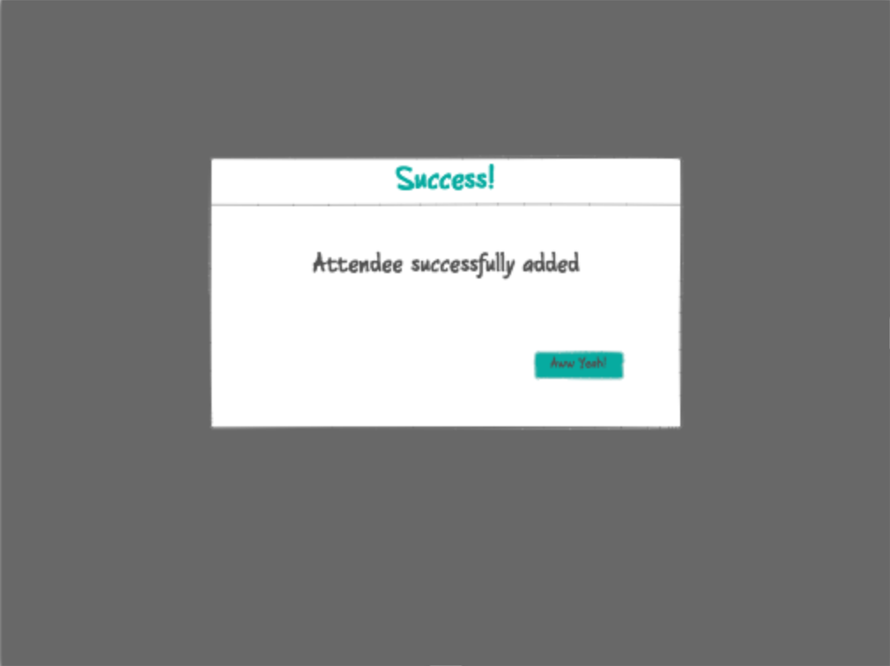
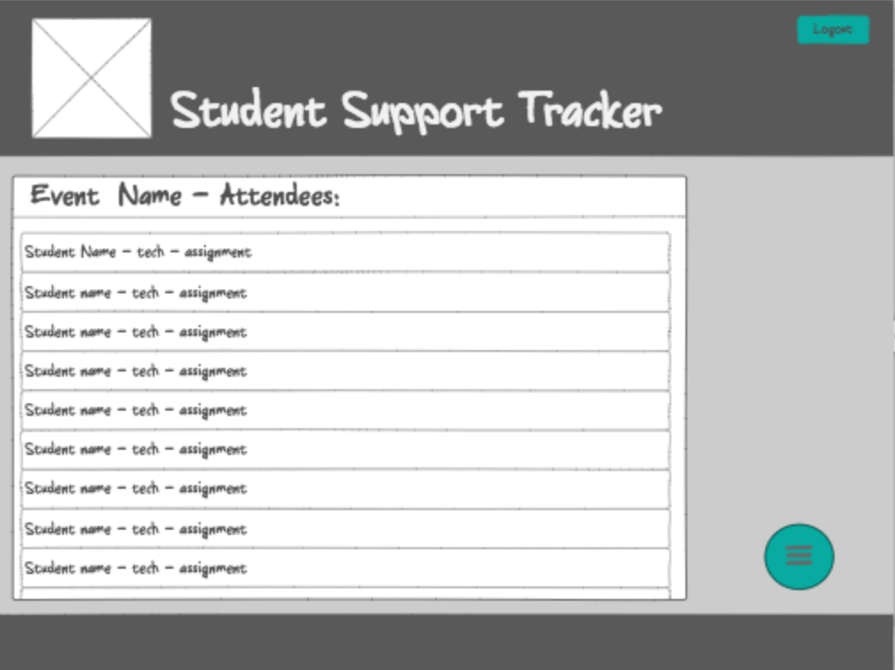
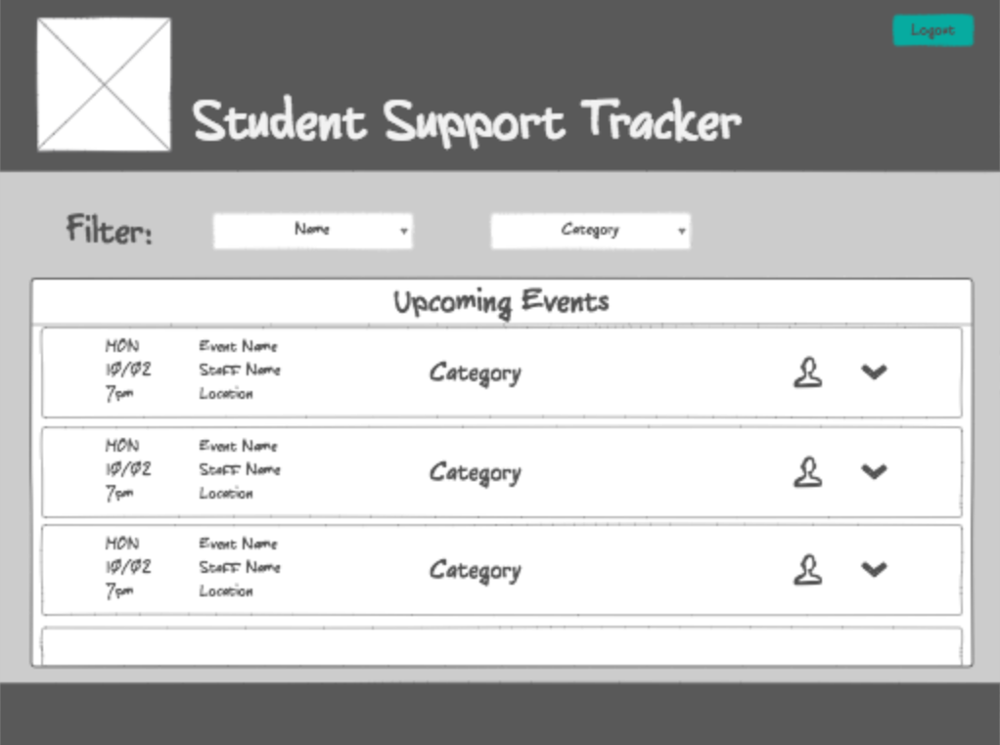

Student Support Tracker
===

Description:
---
Create a subject and time tracker. 

Version 1.0: 

- users can log in with @primeacademy.io email

- users will be able to view upcoming events and event details

- users will be able to submit a new Event

- users will be able to add attendees for Events and view who has signed up to attend

- users will be able to add Categories
- basic report that lists all Events
- filter said list by user
- filter said list by category

Version 2.0:
- filter report by multiple users &/or categories
- visual representation via bar charts/pie graphs/etc.
- set start/end date for reports (default of all for current year)

Tech:
---

- HTML
- Angular Material
- CSS/Sass
- JS
- AngularJS
- SQL
- Node
- Express

Tables:
---

Categories:

- id
- name

Events:

- id
- user
- category_id
- dateTime
- hours
- students_in_attendance

